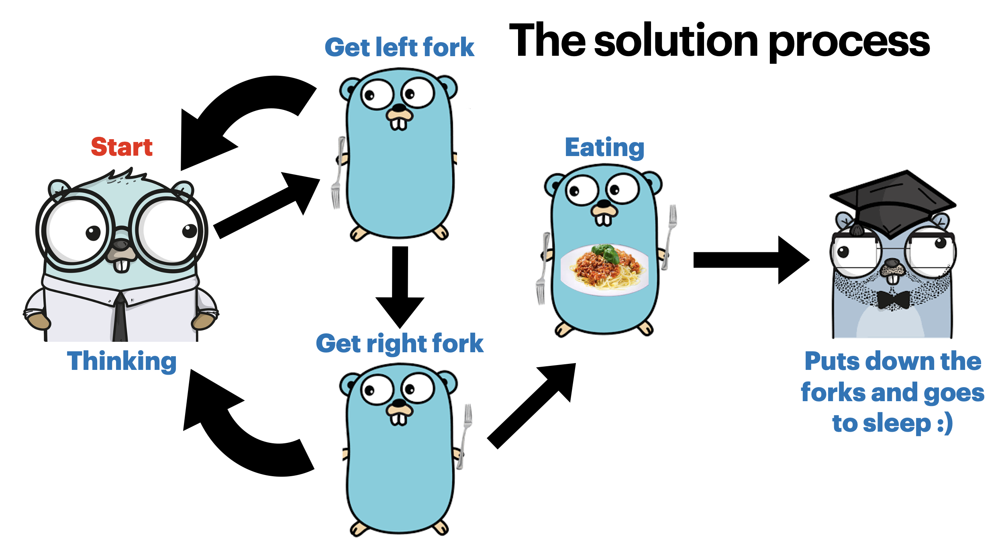

# Dining Philosophers Problem
The dining philosophers problem is an example problem often used in concurrent algorithm design 
to illustrate synchronization issues and techniques for resolving them.

## Problem statement:
* There are 5 philosophers sitting around a round table eating spaghetti and each of them has one fork between them (i.e. a total of five forks).
* Every philosopher has two states: eating and thinking.
* When a philosopher gets hungry, he tries to acquire his left and right fork, one by one. If successful in acquiring two forks, he eats for a while, then puts down the forks (thus allowing other philosopher to pick it up), and continues to think.

### Deadlock 
When each philosopher picks up the fork to their left, they also end up picking the right fork of the
person sitting next to them which leaves every philosopher with just one fork and nobody can start eating. 
Since every philosopher is dependent on each other, it forms a circular-wait and the system goes into a deadlock condition.

     

# Solution
